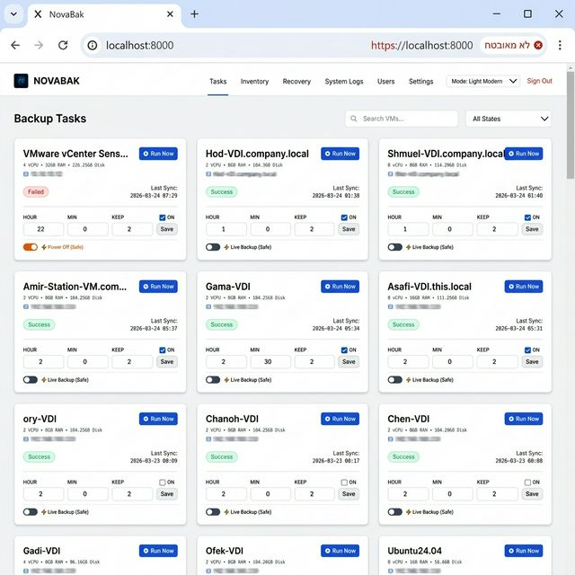
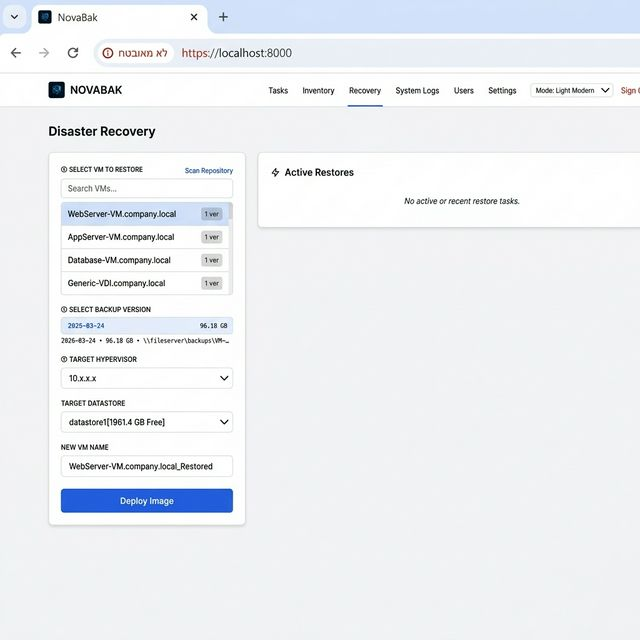
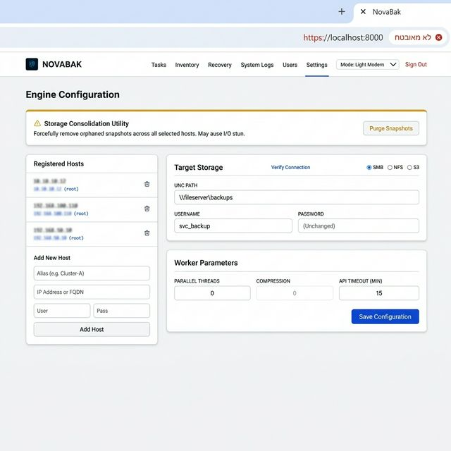
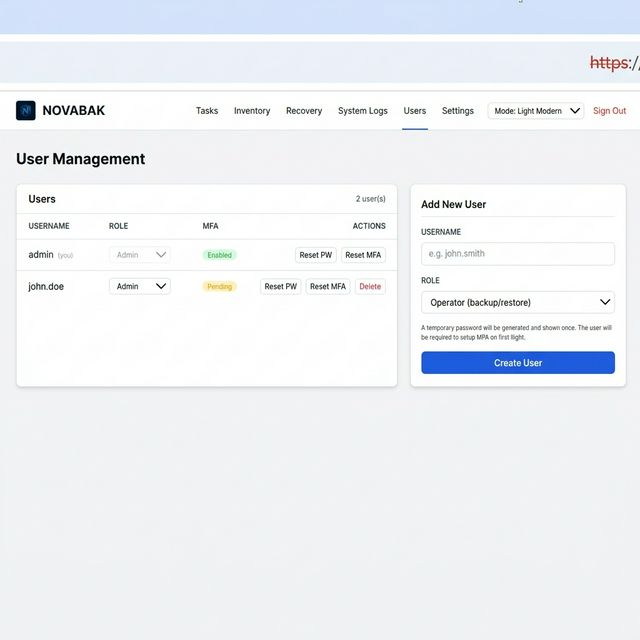

<p align="center">
  
</p>

<h1 align="center">NovaBak</h1>
<p align="center"><strong>Enterprise VM Backup & Disaster Recovery for VMware ESXi</strong></p>

<p align="center">
  
  
  
  
  
  
</p>

---

## Overview

NovaBak is a self-hosted, web-based backup and disaster recovery platform for **VMware ESXi** environments. It runs as a lightweight Python service on Windows Server or inside Docker, and requires zero agents on the VMs being protected.

### Key Features

- **Agentless backup** — uses ESXi's native HTTP datastore access and snapshot API (pyVmomi), no software installed on VMs
- **Per-VM scheduling** — independent cron-like schedule (hour + minute) and retention policy per VM
- **Live or Power-Off backup modes** — backup running VMs safely, or power them off temporarily for faster throughput
- **Hierarchical Disaster Recovery** — browse backups by VM, choose a specific date version, and restore to any host/datastore
- **Multiple storage backends** — SMB/CIFS, NFS, or S3-compatible (AWS, Wasabi, MinIO)
- **Role-Based Access Control** — Admin / Operator / Viewer with forced MFA for all users
- **HTTPS** — auto-generated self-signed TLS certificate on first run
- **Email notifications** — SMTP alerts on backup success/failure

---

## Screenshots

<table>
  <tr>
    <td></td>
    <td></td>
  </tr>
  <tr>
    <td align="center"><em>Backup Tasks — per-VM schedule, status & progress</em></td>
    <td align="center"><em>Disaster Recovery — hierarchical VM & version picker</em></td>
  </tr>
  <tr>
    <td></td>
    <td></td>
  </tr>
  <tr>
    <td align="center"><em>Engine Configuration — hosts, storage & worker settings</em></td>
    <td align="center"><em>User Management — roles, MFA status, admin actions</em></td>
  </tr>
</table>

---

## Quick Start

### Option A — Docker (recommended)

```bash
git clone https://github.com/haimtoledano/VMBackup.git
cd VMBackup

# Initialize a clean database with default admin/admin credentials
python init_db.py

# Start all services
docker-compose up -d
```

Open: **https://localhost** or **https://localhost:8000**

> Your browser will warn about a self-signed certificate. Click **Advanced → Proceed** to continue.

---

### Option B — Windows Native (Windows Server 2016+)

```bat
git clone https://github.com/haimtoledano/VMBackup.git
cd VMBackup

:: Run as Administrator
setup.bat
```

This will:
1. Create a Python virtual environment
2. Install all dependencies
3. Register both the Web UI and Worker as Windows Scheduled Tasks (auto-start on boot)

Open: **https://localhost:8000**

---

## First Login

| | |
|---|---|
| **URL** | `https://localhost:8000` |
| **Username** | `admin` |
| **Password** | `admin` |

> ⚠️ You will be forced to set up **MFA (TOTP)** on first login using Google Authenticator, Microsoft Authenticator, or any TOTP-compatible app.

> ⚠️ After logging in, go to **Users** tab and reset the admin password immediately.

---

## User Roles

| Role | Permissions |
|---|---|
| **Admin** | Full access: settings, backup, restore, user management |
| **Operator** | Run backups and restores, view logs |
| **Viewer** | Read-only dashboard — no action buttons |

All users are **required to set up MFA** on first login.

---

## Architecture

```
┌─────────────────────────────────────┐
│            NovaBak                  │
│                                     │
│  ┌──────────────┐  ┌─────────────┐  │
│  │  Web UI      │  │  Worker     │  │
│  │  (FastAPI)   │  │  Daemon     │  │
│  │  Port 8000   │  │  (APScheduler)│ │
│  └──────┬───────┘  └──────┬──────┘  │
│         │                 │         │
│         └────────┬────────┘         │
│                  │                  │
│          ┌───────▼────────┐         │
│          │  SQLite DB     │         │
│          │  (data/)       │         │
│          └───────┬────────┘         │
└──────────────────┼──────────────────┘
                   │
        ┌──────────┴──────────┐
        │                     │
   ┌────▼────┐          ┌─────▼────┐
   │ ESXi    │          │ Storage  │
   │ Host(s) │          │ SMB/NFS/S3│
   └─────────┘          └──────────┘
```

---

## Configuration

All configuration is managed through the **Settings** tab in the web UI:

| Section | Description |
|---|---|
| **Registered Hosts** | Add/remove ESXi hosts (IP, credentials) |
| **Target Storage** | SMB share, NFS export, or S3 bucket for backup files |
| **Worker Parameters** | Parallel threads, compression level, API timeout |
| **Email Alerts** | SMTP server, TLS/SSL, recipient address |

---

## Project Structure

```
VMBackup/
├── main.py              # FastAPI web application & API
├── worker.py            # Backup & restore job execution
├── worker_daemon.py     # APScheduler daemon process
├── backup_engine.py     # ESXi HTTP streaming backup engine
├── esxi_handler.py      # pyVmomi API wrapper (snapshots, power, inventory)
├── models.py            # SQLAlchemy models + DB migration
├── auth.py              # bcrypt passwords, TOTP MFA, JWT tokens
├── ssl_util.py          # Auto self-signed TLS certificate generation
├── config_env.py        # Paths & database URL
├── storage_util.py      # SMB / NFS / S3 abstraction layer
├── templates/           # Jinja2 HTML templates
├── docs/screenshots/    # Screenshots for documentation
├── Dockerfile
├── docker-compose.yml
├── setup.bat            # Windows auto-installer
├── init_db.py           # Clean DB initializer (for fresh deployments)
└── requirements.txt
```

---

## Security Notes

- The `data/` directory (SQLite database + TLS certificates + logs) is **excluded from Git**
- Run `python init_db.py` to generate a **clean database** with only the default `admin` account
- Change the default password and complete MFA setup immediately after first login
- All API endpoints are protected by session token authentication
- Self-signed TLS expires in 10 years; replace with a CA-signed cert for production use

---

## Requirements

- **Python 3.11+** (Windows native) or **Docker** (cross-platform)
- Network access to ESXi host(s) on port 443
- SMB share / NFS export / S3 bucket for backup storage
- Minimum 2 GB RAM recommended for the backup service

---

## License

MIT © [haimtoledano](https://github.com/haimtoledano)
